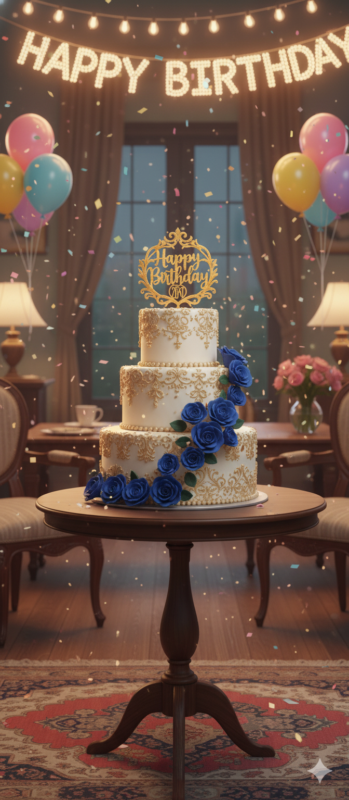

# birthday_wish
<!DOCTYPE html>
<html lang="en">
<head>
    <meta charset="UTF-8">
    <meta name="viewport" content="width=device-width, initial-scale=1.0">
    <title>Happy Birthday 🎉</title>
    
</head>
<body>
    <audio id="bgMusic" loop>
        <source src="birthday-tune.mp3" type="audio/mpeg">
        Your browser does not support the audio element.
    </audio>

    

        <h1>Happy Birthday  🎂✨</h1>
        
On this special day in 2026, I wanted to make something just for you. You're the light in my life, and I'm so grateful for you. Let's celebrate with some magic!

        
Countdown to October 23, 2026: Loading...

        

             
            
            
        

        

            <button onclick="toggleMusic()">Play/Pause Music 🎵</button>
            <button onclick="revealSurprise()">Reveal Hidden Message! 💖</button>
            <button id="finalButton" onclick="revealFinal()">See the Final Message ❤️</button>
            <button onclick="createConfetti()">Even More Confetti! 🎊</button>
            <button onclick="openCamera()">Do you want to see that special person I like? 📸</button>
        

        
        

            <strong>Hidden Message Revealed:</strong> Remember our first Kartik together? You made it unforgettable. On October 23, 2026, I promise more adventures and love. You're my everything! 🎈
        

        
        

            <strong>Final Message:</strong> As October 23, 2026, arrives, know that my heart is yours forever. You've made my world brighter—happy birthday, my dear. I love you more than words can say. 🌟💕
        

    

    
</body>
</html>
